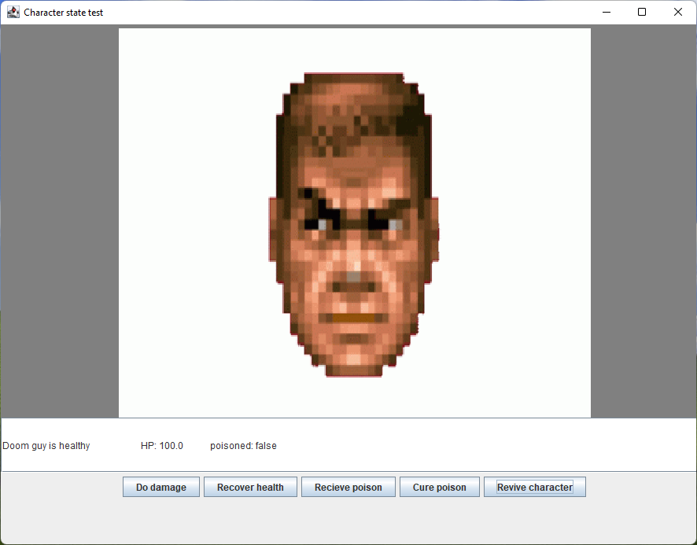
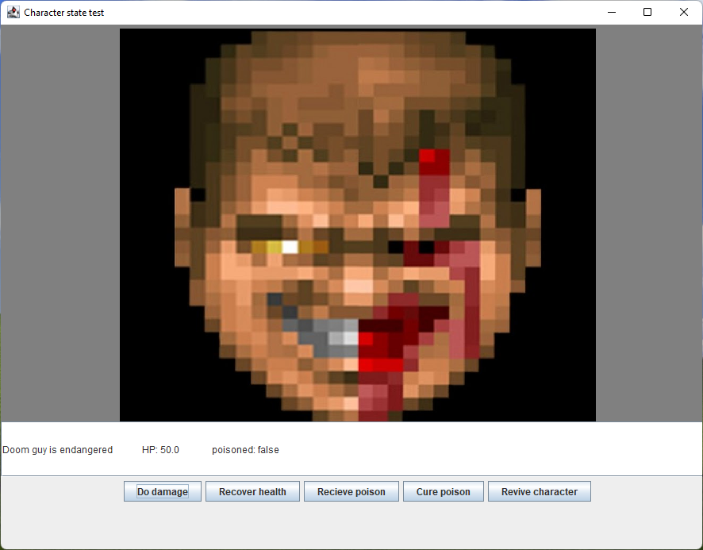
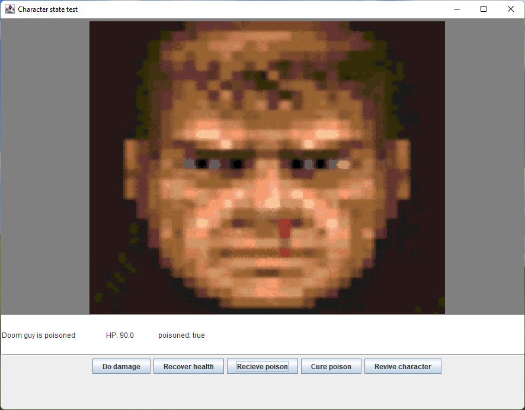
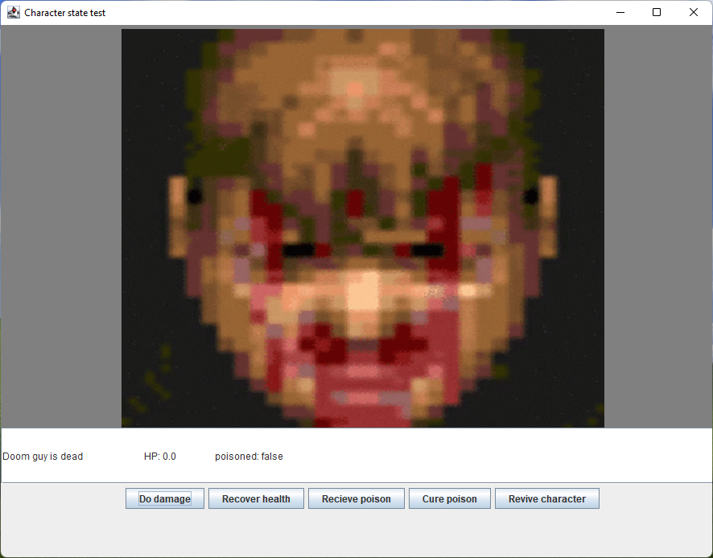
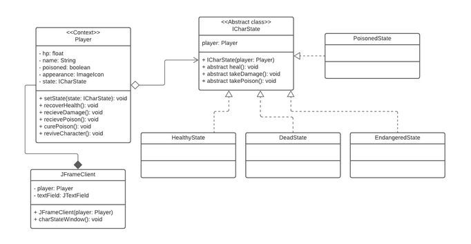

## State Pattern

Projeto desenvolvido na disciplina de arquitetura de software.

## Sobre

O pattern state tem como base uma interface implementada por uma classe de contexto e por possíveis estados que a classe de contexto pode possuir. Assim é possível definir uma série de estados finitos que o objeto pode alcançar.

### Utilidade

O pattern é útil para criar de forma organizada estruturas de classes que evitam a quebra do princípio open-closed, já que se for necessário incluir um novo estado à classe de contexto, basta extender a interface e criar uma classe do novo estado desejado.

### Desenvolvimento

Para representar o pattern de forma visual, foi desenvolvido com o uso de java Swing uma representação da classe "Player", que simboliza diferentes estados de "saúde" que o personagem pode alcançar de acordo com seu hp.

## Estado "normal"

## Estado "ferido"

## Estado "envenenado"

## Estado "morto"

## UML do código

